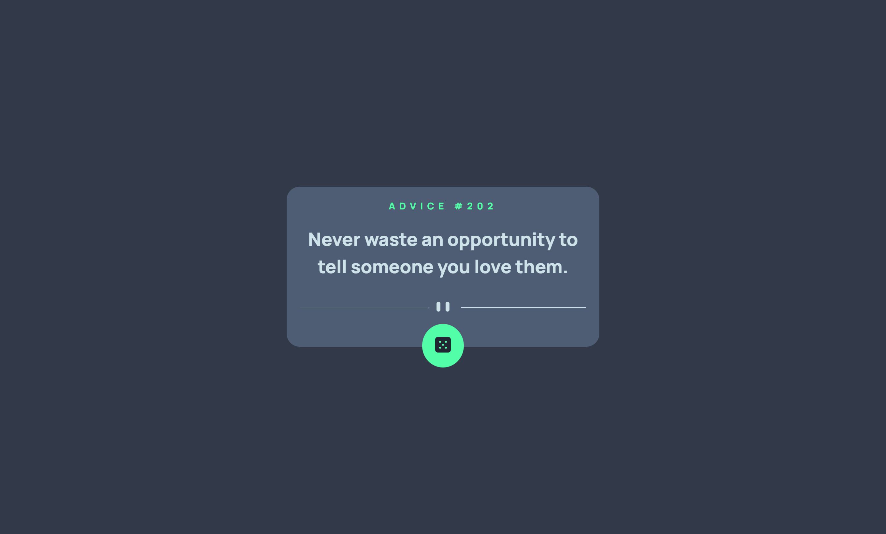
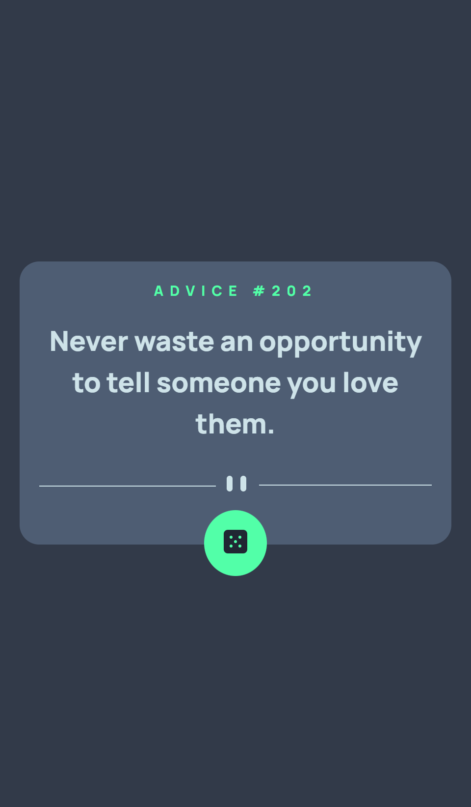

# Frontend Mentor - Advice generator app



## Table of contents

- [Overview](#overview)
  - [The challenge](#the-challenge)
  - [Screenshot](#screenshot)
  - [Links](#links)
- [My process](#my-process)
  - [Built with](#built-with)
  - [What I learned](#what-i-learned)
- [Author](#author)
- [Acknowledgments](#acknowledgments)

## Overview

### The challenge

Users should be able to:

- View the optimal layout for the app depending on their device's screen size
- See hover states for all interactive elements on the page
- Generate a new piece of advice by clicking the dice icon

### Screenshot

#### Desktop view


#### Mobile view



### Links

- Solution URL: [GitHub](https://github.com/onurozbey/advice-generator-app-react.js)
- Live Site URL: [Vercel](https://advice-generator-app-react-js.vercel.app/)

### Built with

- [React](https://reactjs.org/)
- [Css](https://www.w3schools.com/w3css/default.asp)
- [axios](https://github.com/axios/axios)
- [Advice Api](https://api.adviceslip.com/)

### What I learned

I've found the chance that improve my fetch api knowledge with this project and I've used axios library for this. And below there the code part about it is existing.

```js
async function fetchAdvice() {
  try {
    const data = await axios.get("https://api.adviceslip.com/advice");
    // console.log(data.data.slip);
    setAdvice(data.data.slip);
  } catch (error) {
    console.error(error);
  }
}
```
